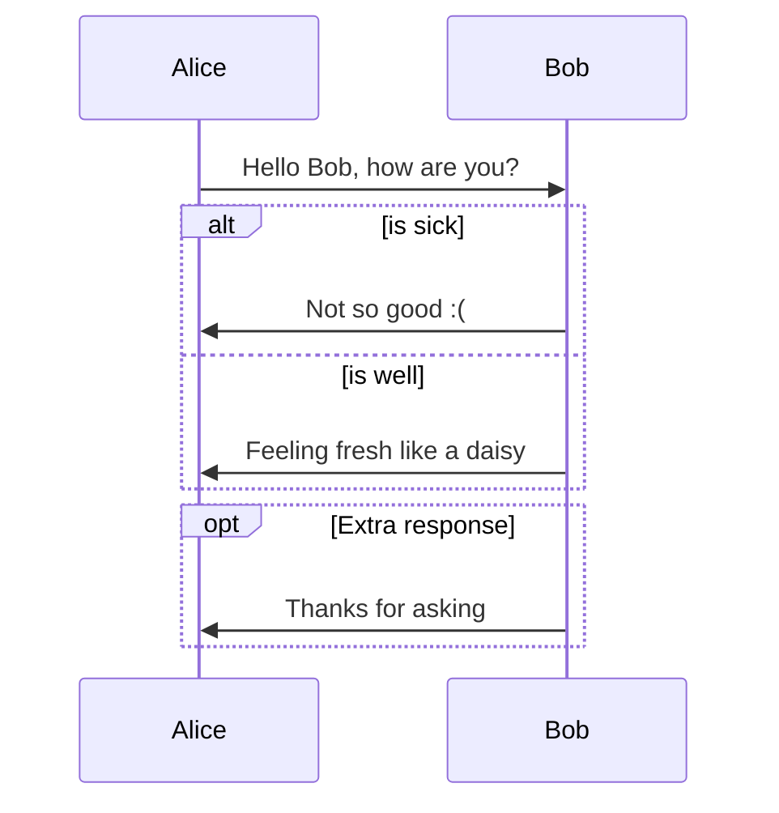
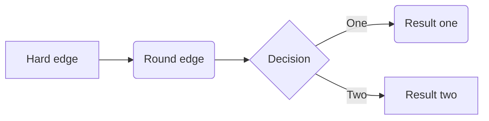
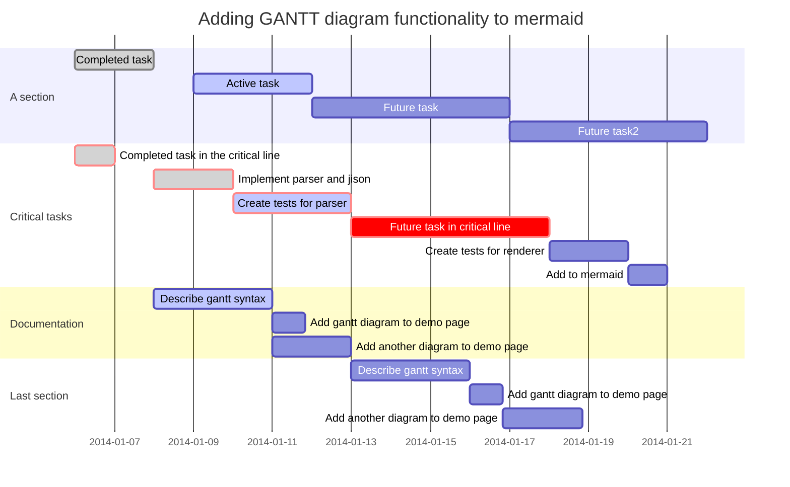

# 使用Typora Markdown画图

## 时序图(Sequence)
Typora时序图是依托于[js-sequence](https://bramp.github.io/js-sequence-diagrams/)实现。来看一个例子：

```sequence
Alice->Bob: Hello Bob, how are you?
Note right of Bob: Bob thinks
Bob-->Alice: I am good thanks!
```


## 流程图(Flowchart)
Typora流程图依托于[flowchart.js](http://flowchart.js.org/)实现。来看个例子：
```flow
st=>start: Start
op=>operation: Your Operation
cond=>condition: Yes or No?
e=>end

st->op->cond
cond(yes)->e
cond(no)->op
```


## mermaid diagrams
Typora另外还结合[Mermaid](https://mermaidjs.github.io/)，支持了Mermaid模式下的时序图(sequence)，流程图(flowchart)和甘特图(Gantt)。

### 时序图(mermaid sequence)



### 流程图(mermaid flowchart)



### 甘特图(mermaid Gantt)



##  注意事项
* 由于目前 standard Markdown、CommonMark、GFM 暂不支持画图，所以建议使用对应工具画图，导出图片，插入到Markdown文本中，保证不丢失。


----
## 参考文献
* [Draw Diagrams With Markdown](http://support.typora.io/Draw-Diagrams-With-Markdown/) 
* [typora-wiki-github](https://github.com/typora/wiki-website)
* [Mermaid document](https://mermaidjs.github.io/)
